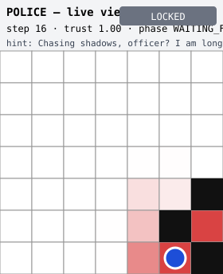
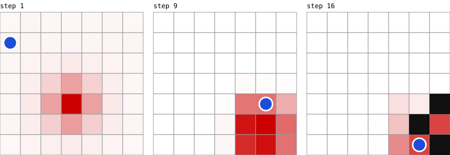

# Police-vs-Thief — Distributed AI Pursuit (P2P)

> **This repository: the THIEF peer.** Paired repo (the other agent): https://github.com/akariya-mohammed/orcai-mj-cop

> Final project · *Orchestration of AI Agents*, Dr. Yoram Segal, University of Haifa.
> Code aligned to guidelines book **v3.0.0**. Companion repo (the other agent): https://github.com/akariya-mohammed/orcai-mj-cop.

Two autonomous AI peers — Cop and Thief — chase each other on a 7×7 grid with **no central server,
no shared state, no referee**. Each peer is an independent process with its own FastMCP server, config,
and GUI. Integrity rests on per-step **SHA-256 commit-reveal** verified by a mutual post-game audit.

---

## Academic Report

*(Mandatory 6-part structure — Book Ch. 9. Fill each section before submission.)*

### 1. The Dec-POMDP model

The race is formalized as a two-agent decentralized POMDP. Our implementation maps the
tuple directly onto code: **n = 2** (police, thief); **S** — both positions, the barrier
set, and the decaying scent field (`domain/board.py`, `domain/smell.py`); **Aᵢ** —
N/S/E/W/STAY plus, for the cop only, a Barrier-Law placement on its own cell or a
neighbor (`domain/own_state.py`); **P** — deterministic physics enforced identically by
both peers from the byte-signed contract `config/game.json` (Rule 11); **R** — the signed
scoring table (capture 20/5, survival 5/10, tie 2/2, technical loss 0/0,
`domain/scoring.py`); **Ωᵢ/O** — each peer observes only the opponent's scent snapshot
and a free-text hint that may be a lie — never the opponent's position. Each side
maintains a Bayesian belief b(s) over the opponent (`domain/belief.py`): von-Neumann+stay
diffusion (a deliberate, documented deviation from the reference's king-step — this game
has no diagonal moves, and belief is private, so the tighter transition model is free
accuracy), scent fusion via exp(trust·τ), and hint-conditioned reweighting. No discount
factor is used because the policy is search/heuristic, not learned (§4).

### 2. FastMCP orchestration dilemmas

Every peer is **simultaneously server and client** (`infra/mcp_server.py` exposes
`receive_move` + `handshake`; `infra/mcp_client.py` calls the opponent's). Dilemmas we
hit and resolved: (a) *sync game, async transport* — fastmcp's client is async while a
turn-based game is inherently sequential; `OpponentLink` bridges with one `asyncio.run`
per call, keeping the runtime free of async plumbing; (b) *no central referee* — there is
deliberately no orchestrator process (Rules 1–3): the per-peer facade (`PeerProcess`)
wires config → server → runtime → link, and truth is established by the pre-game
handshake (byte-identical contract hashes, role-conflict rejection, clock-free shared
game-uid derivation) plus per-move cryptography, not by authority; (c) *turn order* —
the thief moves first, enforced structurally (the police loop cannot act before the first
incoming message); (d) *failure is a first-class state* — a silent opponent resolves via
deadline → retry → `TECHNICAL_LOSS` (a legal phase-machine transition) with a persisted
audit snapshot, and an independent watchdog detects a frozen main loop (Rules 6–7);
(e) *quota safety* — all outbound API calls pass the `ApiGatekeeper` sliding-window
limiter (queues, never errors).

### 3. Strategies implemented

**Thief:** Manhattan flee over the belief argmax (prefer unvisited; HOLD when walled).
**Police:** the empirical finding that drives the whole design is that *blind chase never
captures* — a lone cop on a Cartesian grid is robber-win, and our Stage-3 experiment
shows an eternal distance-6 plateau. Capture therefore comes from `TrapperPolice`
(`strategy/trapping.py`): an A*-style **forced-capture search** over cop action sequences
(including Barrier-Law placements) against a deterministic opponent model, playing the
first action of the shortest capture line (R46 barrier-kill / overlap / R47 enclosure),
with interception chase as fallback. Two earlier reward-shaped designs failed with a
*guarding pathology* (optimizing containment instead of capture) — documented in
[RESEARCH-REPORT-Performance-Analysis.md](docs/RESEARCH-REPORT-Performance-Analysis.md).
**Deception:** hints are judged against the speaker's own unfakeable scent (Book Ch. 4);
proven lies suppress the claimed region and crash the speaker's trust EMA — deception
becomes self-disclosure. Because that detector runs on both sides of the table, our own
peers volunteer nothing parseable and speak only under threat. Result: **94 % scent-only capture vs a talkative opponent (67 % vs a silent
one), ~14 avg steps, 0 tokens consumed**.

### 4. Learning curves (only if RL used)

Not applicable — by design. Reinforcement learning is one optional track in the course
book; we chose the equally-sanctioned heuristic/own-algorithm track (deterministic
search + Bayesian belief), so there is no training phase and no convergence curve. The
empirical evidence of strategy quality is the capture-rate study in the research report.

### 5. Screenshots (mandatory)

Generated deterministically from a real seeded match (`uv run python scripts/render_docs_images.py`):

**Live GUI — belief heatmap, turn banner, trust (local truth only):**



**Belief evolution across the pursuit:**



**Replay Viewer verdict — real cryptographic verification pass:**


(Live window: `uv run police-thief peer --role police --gui`)

### 6. Link to the paired repo
Cross-link to the cop/thief companion repository (see top of file).

---

## Run

```bash
uv sync

# Available now — DEV TOOL: local self-play sim of the two shipped brains
uv run police-thief selftest --steps 15

# Live localhost pair (per-role private configs in config/police/ and config/thief/):
uv run police-thief peer --role police     # Terminal 1
uv run police-thief peer --role thief      # Terminal 2
# Handshake verifies byte-identical contracts; the thief moves first.
# (Bounded run — capture/termination protocol lands in Stage 6.)

# Verify a finished match log: "Verified OK" (exit 0) or "TAMPERED" (exit 1)
uv run police-thief replay --log artifacts/log_<game-id>_g01.json

# Local self-play series -> the 4 mandatory JSON artifacts
uv run police-thief series --games 2
```

Tests: `pytest` from the repo root (no environment variables needed).

## Layout
- `config/` — `game.json` (signed, shared, byte-identical) · `game.toml` (private, per-peer)
- `src/police_thief/` — `domain/` (rules, crypto, state) · `strategy/` (brains) · `infra/` (MCP, Gmail, gatekeeper) · `gui/` (window, replay, SVG)
- `docs/` — PRD-1..7, STRATEGY.md, RESEARCH-REPORT-Performance-Analysis.md
- `tests/` — pytest

## License
Educational use per course terms.
